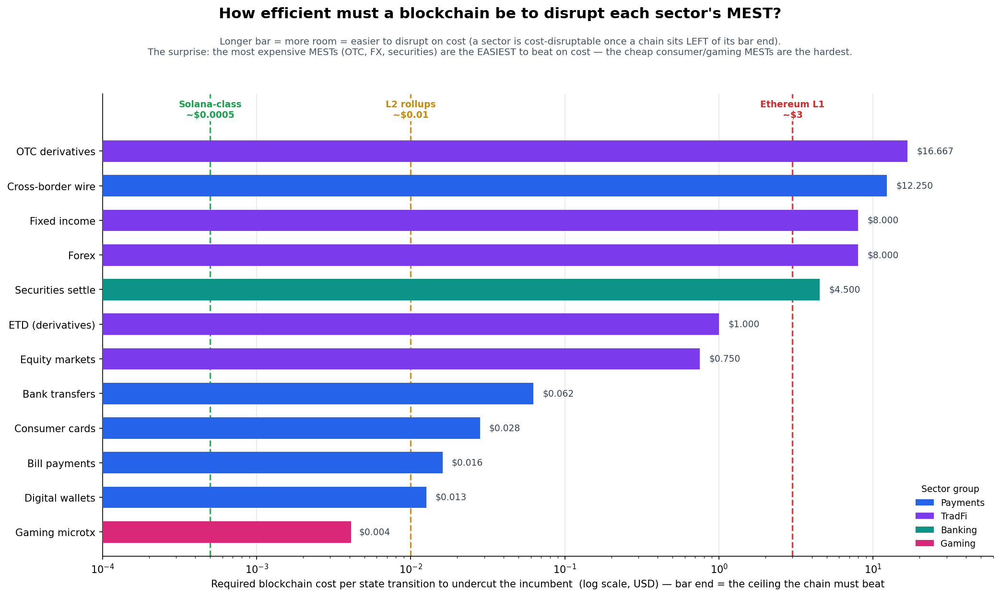

# The Cost of MEST by Sector — and the Blockchain Disruption Threshold

> Not all MESTs cost the same. A gaming microtransaction's state change is an
> internal database write costing a hundredth of a cent; a securities settlement's
> is an irrevocable, custody-bearing, regulator-reported transfer costing dollars.
> That ~1000× spread decides which industries a blockchain can actually disrupt —
> and the answer is the opposite of what most people assume.

*A Universe of Finance capsule. Run 14. Confidence: 🟡 Medium on the cost ordering,
🔴 Low on the absolute levels. Reproducible via `tools/mest_cost.py`.*

---

## 1. The Question

The [MEST framework](MEST.md) counts bilateral state transitions; the
[MEST Advantage](MEST_ADVANTAGE.md) priced the aggregate MEST Tax (~$350–400B/yr).
This capsule goes one level down: **what does a single MEST cost, and why does it
vary by three orders of magnitude across the economy?** Then it uses that answer to
draw the line Ferg asked for — *how efficient must a blockchain be to disrupt the
transfer and ownership machinery of a given industry?*

The punchline, derived below and charted in §4:

> **The most expensive MESTs are the easiest for a blockchain to beat on cost.
> The cheapest MESTs — consumer payments and gaming — are the hardest.**

---

## 2. Cost per MEST by *Type* (why a securities MEST ≫ a gaming MEST)

A MEST's cost is set by *what kind of state transition it is*, not by the dollar
value moving. The [MEST taxonomy](MEST.md#the-mest-taxonomy) sorts cleanly by cost:

| MEST type | $/MEST (order of magnitude) | Why it costs what it costs |
|---|---|---|
| **Ledger credit/debit** (internal) | $0.0001 – $0.001 | An internal DB write. No external party, no finality guarantee. |
| **Authorization** | $0.001 – $0.01 | A contingent hold — cheap to place, cheap to void. |
| **Fee/commission** | $0.005 – $0.05 | Calculate, allocate, and book on both sides. |
| **Revenue recognition** | $0.01 – $0.10 | Recognition plus the tax/audit counterparty who cares. |
| **Payment leg** | $0.01 – $0.05 | Value movement across two institutions' ledgers. |
| **Clearing event** | $0.02 – $0.20 | Match, validate, novate — CCP operations. |
| **Audit trail / reconciliation** | $0.02 – $0.50 | Labour-heavy; the back-office cost centre. |
| **Netting entry** | $0.05 – $0.50 | Multilateral position compression (CCP/CLS). |
| **Custody movement** | $0.10 – $1.00 | CSD/omnibus transfer; asset-servicing overhead. |
| **Risk / margin adjustment** | $0.10 – $2.00 | Bilateral margin call + collateral movement. |
| **Settlement leg** | $0.10 – $2.00 | **Irrevocable finality (RTGS/DvP) — the expensive one.** |
| **Regulatory report** | $0.10 – $5.00 | Reportable-event capture + filing infrastructure. |

**The ordering principle: cost rises with *irreversibility, mutuality, and
oversight*.** A state change that one party can undo inside its own database is
nearly free. A state change that must be final, agreed by a counterparty, held in
custody, margined, *and* reported to a regulator is expensive — because each of
those properties requires its own institution, reconciliation, and legal backstop.

So, directly answering the question: **a securities MEST is ~100–1000× more
expensive than a gaming MEST**, because a securities trade is built from the
expensive types (clearing + netting + custody + settlement finality + regulatory
report) while a gaming microtransaction is built almost entirely from the cheapest
type (an internal ledger write with no external counterparty at all).

---

## 3. Cost per MEST by *Sector* — and the disruption model

Each sector is a *recipe* of MEST types, giving it a representative cost-per-MEST
(`c`) and an incumbent multiplier (`m`, MESTs per transaction, from
[MEST Advantage §3.1](MEST_ADVANTAGE.md)). A blockchain replaces the whole `m`-MEST
cascade with a small **residual** `r` of on-chain state transitions (2–3 —
atomic settlement still needs a debit and a credit; see the
[irreducible floor](MESTCV.md#9-the-irreducible-mest-floor-what-condensation-does-not-remove)).

The blockchain undercuts the incumbent when

```
        r × (chain cost per state transition)   <   m × c
                                                     └── incumbent friction / txn
```

so the **disruption threshold** — the most a chain's state transition can cost and
still win — is:

```
        b*  =  (m × c) / r          [ USD per on-chain state transition ]
```

| Sector | Group | m | $/MEST (c) | residual r | Friction/txn (m·c) | **b\*** ($/state-tx) |
|---|---|---:|---:|---:|---:|---:|
| Gaming microtx | Gaming | 4 | 0.002 | 2 | $0.008 | **$0.004** |
| Digital wallets | Payments | 5 | 0.005 | 2 | $0.025 | **$0.013** |
| Bill payments | Payments | 4 | 0.008 | 2 | $0.032 | **$0.016** |
| Consumer cards | Payments | 7 | 0.008 | 2 | $0.056 | **$0.028** |
| Bank transfers | Payments | 5 | 0.025 | 2 | $0.125 | **$0.063** |
| Equity markets | TradFi | 10 | 0.15 | 2 | $1.50 | **$0.75** |
| ETD (derivatives) | TradFi | 10 | 0.30 | 3 | $3.00 | **$1.00** |
| Securities settle | Banking | 9 | 1.00 | 2 | $9.00 | **$4.50** |
| Forex | TradFi | 8 | 2.00 | 2 | $16.00 | **$8.00** |
| Fixed income | TradFi | 8 | 2.00 | 2 | $16.00 | **$8.00** |
| Cross-border wire | Payments | 7 | 3.50 | 2 | $24.50 | **$12.25** |
| OTC derivatives | TradFi | 10 | 5.00 | 3 | $50.00 | **$16.67** |

The thresholds span **four orders of magnitude — from $0.004 to $16.67.**

---

## 4. The Chart: How Efficient Must a Blockchain Be?



Each bar is a sector's threshold `b*` — the cost ceiling a chain must beat. The
dashed lines mark what real chains cost to process one state transition today:

| Reference | ~$/state transition | Reality |
|---|---|---|
| **Solana-class** | ~$0.0005 | High-throughput L1s; sub-cent fees |
| **L2 rollups** | ~$0.01 | Base / Arbitrum / Optimism typical |
| **Ethereum L1** | ~$3 | Congested base layer |

**A sector is cost-disruptable once a chain sits to the LEFT of its bar end.**
Reading the chart:

- **Trivially disruptable (any chain wins):** OTC derivatives, cross-border wire,
  FX, fixed income, securities settlement. Their bars extend *past even Ethereum
  L1* — a chain can be 1,000–30,000× less efficient than Solana and still undercut
  the incumbent. **Cost is not the barrier here.**
- **L2-disruptable:** equities, ETD, bank transfers, consumer cards, bill
  payments, digital wallets. A rollup clears them; Solana clears them with room to
  spare. (This is exactly where stablecoins and tokenised T-bills are eating share
  right now.)
- **Hardest (needs Solana-class):** gaming microtransactions, at $0.004. Only the
  most efficient chains clear it — and even then the incumbent (a centralized game
  server) is nearly free *and* solves no trust problem that a chain would solve.

---

## 5. The Counter-Intuitive Finding

Intuition says blockchains should start with cheap, high-volume consumer payments
and work up to complex instruments. The cost model says the **opposite**:

> **Cost-to-disrupt is inversely proportional to how cheap the incumbent MEST
> already is.** High-value instruments carry expensive MESTs (finality, custody,
> margin, reporting), so their disruption threshold is enormous — a chain barely
> has to try. Consumer and gaming MESTs are already near-free, so the threshold is
> punishingly low.

Two corollaries that reframe the whole "blockchain disruption" debate:

1. **For high-value finance, cost is never the binding constraint.** OTC
   derivatives clear a $16.67 threshold that even a congested L1 beats 5×. If DLT
   hasn't displaced them, it is *not* because chains are too expensive — it is
   **legal finality, multilateral netting benefits, liquidity, and regulatory
   acceptance.** The moat is institutional, not computational. Efforts to win these
   sectors should spend on *law and liquidity*, not on shaving basis points of gas.
2. **For consumer payments and gaming, cost is the *only* game — and it's nearly
   lost before it starts.** The incumbent is a free internal ledger write with no
   counterparty risk to intermediate. A chain must be Solana-efficient *and* offer
   a benefit beyond cost (self-custody, composability, cross-border reach) or there
   is simply nothing to disrupt.

This is the mirror image of the [Value/Count Spectrum](README.md): the sectors with
the *fewest, most valuable* transactions are the ones where blockchains have the
largest cost headroom, and the sectors with the *most, cheapest* transactions are
where they have the least.

---

## 6. Reproduce It

```bash
python3 tools/mest_cost.py     # prints both tables + renders the chart
```

`tools/mest_cost.py` holds the type-cost table, the sector recipes, the threshold
formula, and the chain reference costs in one place — edit the numbers and the
chart re-renders. Sensitivity to the two softest inputs (`c` and `r`) is high; the
*ordering* is robust, the *absolute thresholds* are 🔴.

---

## 7. SLE Dispatch

| Role | SLE | Contribution |
|---|---|---|
| **Lead** | `transaction-lifecycle-analyst` | Owns the MEST-type recipe per sector and the residual `r` |
| Secondary | `post-trade-specialist` | Cost realism for clearing/netting/custody/settlement MESTs (the expensive types) |
| Secondary | `crypto-forensics-analyst` | Real per-state-transition chain costs (the reference lines) |
| Secondary | `forensic-accountant` | Fee-income → implied cost-per-MEST cross-check |
| Secondary | `market-microstructure-analyst` | Why the moat is liquidity/finality, not cost, for §5.1 |

---

## 8. Open Questions (Run 15)

- **Firm the cost-per-MEST `c` by sector** — currently mid-of-range estimates;
  anchor each to a disclosed fee schedule (NSCC, CME, CLS, SWIFT gpi, card
  interchange) divided across its MEST cascade.
- **Residual `r` is doing a lot of work** — for margined/complex instruments the
  true on-chain residual may be 3–4, not 2; re-derive per instrument.
- **Add the non-cost axis** — plot each sector on (cost headroom) × (institutional
  moat) to show *why* the cost-easy sectors remain un-disrupted.
- **Chain-cost bands move** — L2 fees and Solana fees change with demand; publish
  the reference lines as ranges, and re-run when they shift.

---

## 9. Sources & Anchors

- Universe of Finance: [MEST](MEST.md) (the type taxonomy),
  [MEST Advantage §2.1 & §3.1](MEST_ADVANTAGE.md) (cost-per-MEST ranges, multipliers,
  DLT residuals), [MESTcv](MESTCV.md) (the irreducible floor).
- Card interchange: ~$187.2B global swipe fees, 2024 (per MEST Advantage §2.2).
- Post-trade fee schedules (NSCC/DTCC, CME Clearing, LCH) — for `c` firming.
- On-chain fee trackers (Solana, L2 rollups, Ethereum) — for the reference lines.

> **Confidence statement.** The *ordering* — securities MESTs ≫ payments MESTs ≫
> gaming MESTs, and therefore high-value sectors are the most cost-disruptable — is
> 🟡 Medium and robust to the assumptions. The *absolute thresholds* are 🔴 Low:
> both `c` (cost per MEST) and `r` (on-chain residual) are order-of-magnitude
> estimates. Treat the chart as a map of the terrain, not a survey of it.
